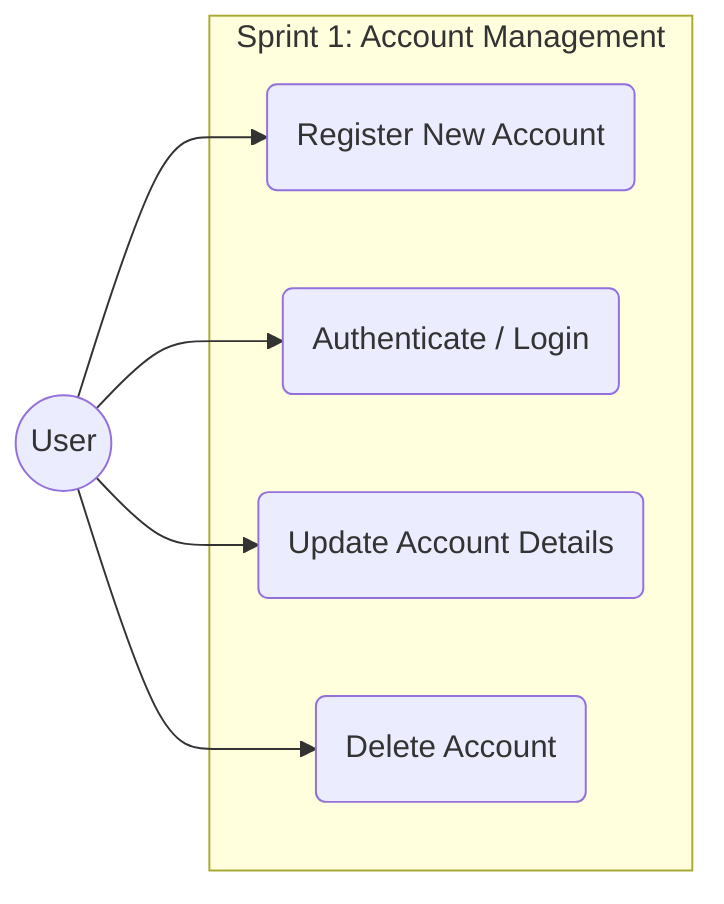
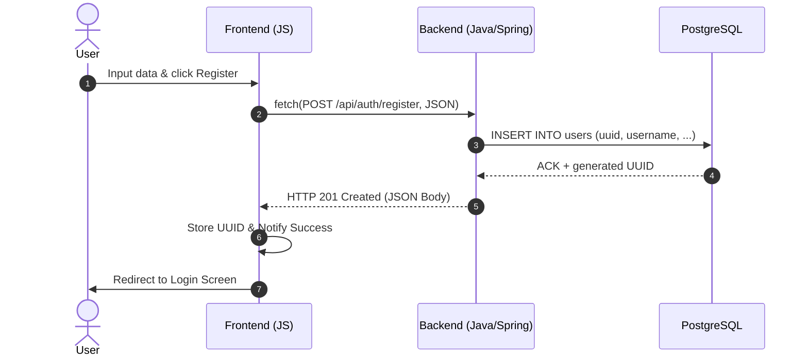
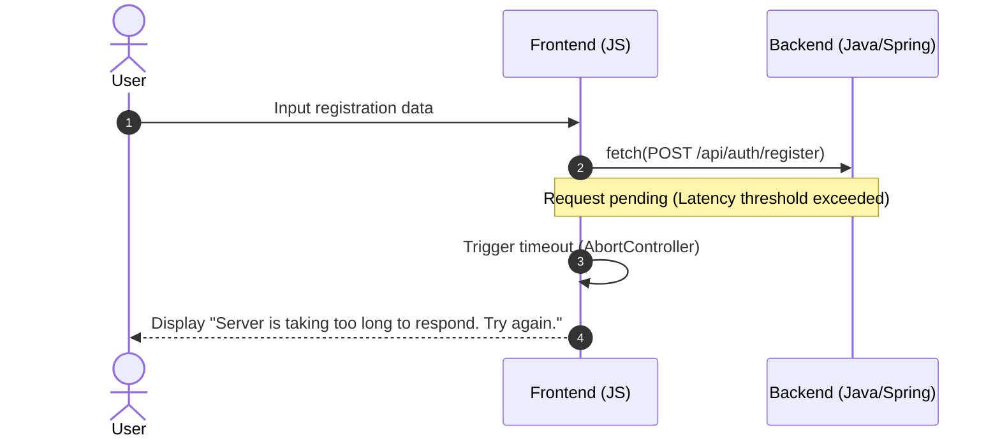
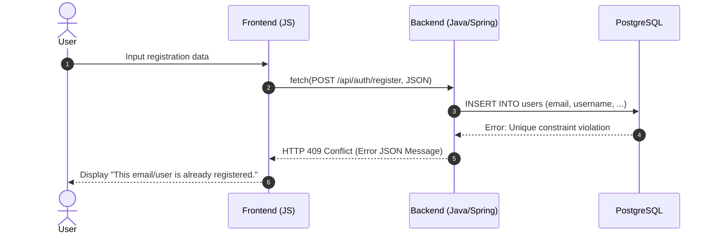

# Tactical Soccer Simulator

## Overview
Tactical Soccer Simulator is a web-based, real-time strategy game focused on the technical and tactical aspects of soccer management. Unlike traditional sports games centered on mechanical control, this project prioritizes logic-driven simulation, tactical positioning, and real-time decision-making.

The project is designed as a full-stack application, emphasizing decoupled architecture, state synchronization, and professional software engineering workflows.

## Architecture
The system follows a Client-Server architecture to ensure separation of concerns:

- **Server (Backend):** Developed in Java with Spring Boot. It acts as the core engine, handling game logic, physics probability, and data persistence.
- **Client (Frontend):** A lightweight implementation using Vanilla JavaScript, HTML5, and CSS3, focused on rendering the simulation and capturing user strategic inputs.
- **Communication:** Integration is achieved through a RESTful API for administrative tasks (account management) and WebSockets (STOMP/SockJS) for real-time match synchronization.

## System Workflows

To ensure a robust decoupled architecture, the following sequence diagrams illustrate the communication between the Vanilla JS client and the Spring Boot backend.

### Case Diagram

### 1. User Registration (Happy Path)
This flow describes the successful creation of a new account and its persistence in PostgreSQL.

### 2. Error by Latency

### 2. Data Conflict

## Tech Stack
- **Backend:** Java 21, Spring Boot, Spring Data JPA, Spring Security.
- **Frontend:** HTML5, CSS3, JavaScript (ES6+).
- **Database:** PostgreSQL.
- **Real-time:** WebSockets for bidirectional communication.
- **Project Management:** Git Flow, Kanban, and UML Modeling.

## MVP Scope
The Minimum Viable Product (MVP) focuses on the core match experience and basic persistence:
- **Authentication System:** Secure user registration and login.
- **Match Engine:** Real-time simulation of soccer matches based on player attributes and tactical formations.
- **Multiplayer Connectivity:** Room-based matchmaking using unique session identifiers.
- **Persistence:** Storage of user profiles and match history.

## Project Structure
- `/client`: Frontend source code and assets.
- `/server`: Backend Spring Boot application and business logic.
- `/docs`: Technical documentation, including UML diagrams and database schemas.

## Engineering Principles
This project adheres to industry-standard practices:
- **Object-Oriented Programming (OOP):** Focus on maintainability and encapsulation.
- **SOLID Principles:** Ensuring scalable and robust code.
- **Clean Code:** Prioritizing readability and meaningful naming conventions.
- **Version Control:** Consistent use of Git Flow for feature development and releases.

## How to Run
Soon
