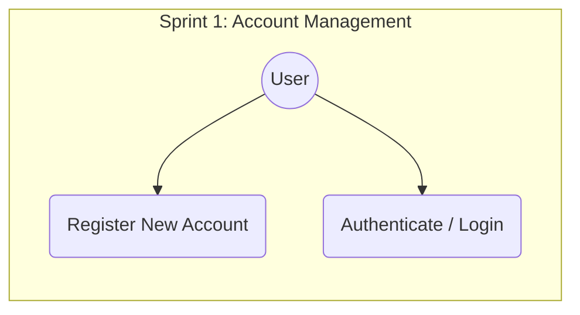
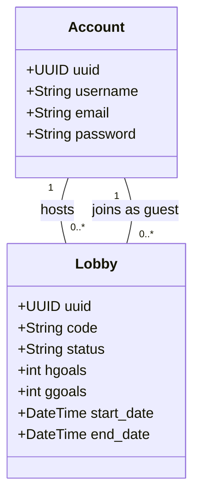

# Tactical Soccer Simulator

## Overview
Tactical Soccer Simulator is a web-based, real-time strategy game focused on the technical and tactical aspects of soccer management. Unlike traditional sports games centered on mechanical control, this project prioritizes logic-driven simulation, tactical positioning, and real-time decision-making.

The project is designed as a full-stack application, emphasizing decoupled architecture, state synchronization, and professional software engineering workflows.

## Project Roadmap & Sprint Log

| Sprint | Status | Title & Core Focus | Completion |
| :--- | :---: | :--- | :--- |
| **01** | ✅ | User Authentication & Database Setup | Feb 01-Mar 02  2026 |
| **02** | 🏗️ | Lobbies, Docker & Technical Debt | In Progress |

> For a detailed breakdown of tasks and retrospectives, check the [Sprint Reports](https://github.com/Luis-HF/football-tactical-simulator/tree/develop/docs) folder.

## Architecture
The system follows a Client-Server architecture to ensure separation of concerns:

- **Server (Backend):** Developed in Java with Spring Boot. It acts as the core engine, handling game logic, physics probability, and data persistence.
- **Client (Frontend):** A lightweight implementation using Vanilla JavaScript, HTML5, and CSS3, focused on rendering the simulation and capturing user strategic inputs.
- **Communication:** Integration is achieved through a RESTful API for administrative tasks (account management).

##  UX/UI Design
The interface and user flow were meticulously planned in Figma to ensure a strategic and intuitive experience.
- [Link to Figma Project](https://www.figma.com/design/Uvjqu4GGMy0fXH5dlhr4Jw/Football-Simulator---Sprint-1---Design?node-id=0-1&p=f&t=6BZogxtkWC1aDU3S-0)

## System Workflows
To understand how the frontend communicates with the backend and handles edge cases (like latency or data conflicts), please refer to our [Detailed Workflows](x).

To ensure a robust decoupled architecture, the following sequence diagrams illustrate the communication between the Vanilla JS client and the Spring Boot backend.

<h3 align="center">USE CASE DIAGRAM</h3>

```mermaid
graph LR
subgraph "Sprint 1: Account Management"

    User((User))

        UC1(Register New Account)
        UC2(Authenticate / Login)
    end

    User --> UC1
    User --> UC2
```

<h3 align="center">ENTITIES DIAGRAM</h3>

```mermaid
classDiagram

    class Account {
        +UUID uuid
        +String username
        +String email
        +String password
    }

    class Lobby {
        +UUID uuid
        +String code
        +String status
        +int hgoals
        +int ggoals
        +DateTime start_date
        +DateTime end_date
    }

    Account "1" -- "0..*" Lobby : hosts
    Account "1" -- "0..*" Lobby : joins as guest
```

### Security Roadmap
- [x] REST API Authentication flow.
- [ ] **BCrypt Password Hashing** (Scheduled for Sprint 2).
- [ ] JWT Stateless Authentication.

## Tech Stack
- **Backend:** Java 21, Spring Boot, Spring Data JPA, Spring Security.
- **Frontend:** HTML5, CSS3, JavaScript (ES6+).
- **Database:** PostgreSQL.
- **Project Management:** Git Flow, Kanban, and UML Modeling.

## MVP Scope
The Minimum Viable Product (MVP) focuses on the core match experience and basic persistence:
- **Authentication System:** Secure user registration and login.
- **Match Engine:** Real-time simulation of soccer matches based on player attributes and tactical formations.
- **Multiplayer Connectivity:** Room-based matchmaking using unique session identifiers.
- **Persistence:** Storage of user profiles and match history.

## Project Structure
- `/client`: Frontend source code and assets.
- `/server`: Backend Spring Boot application and business logic.
- `/docs`: Technical documentation, including UML diagrams and database schemas.

## Engineering Principles
This project adheres to industry-standard practices:
- **Object-Oriented Programming (OOP):** Focus on maintainability and encapsulation.
- **SOLID Principles:** Ensuring scalable and robust code.
- **Clean Code:** Prioritizing readability and meaningful naming conventions.
- **Version Control:** Consistent use of Git Flow for feature development and releases.

## How to Run
Soon
