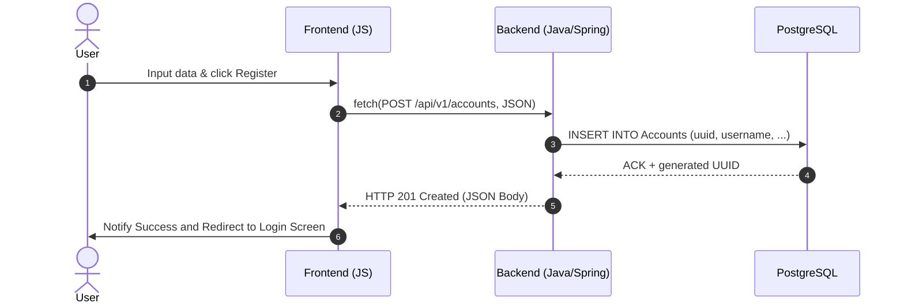
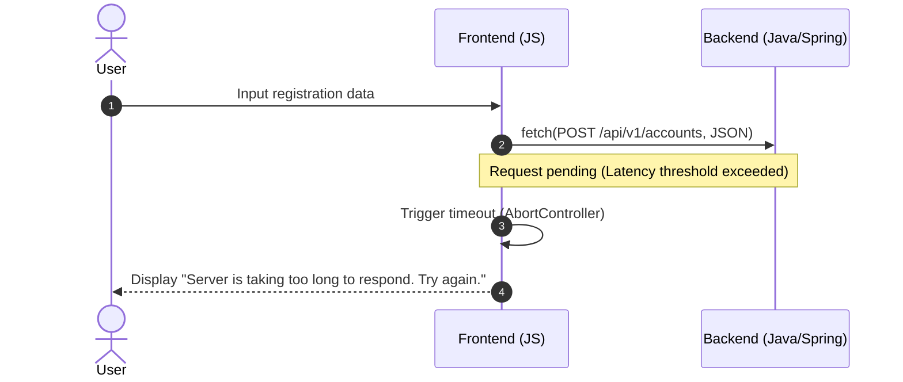
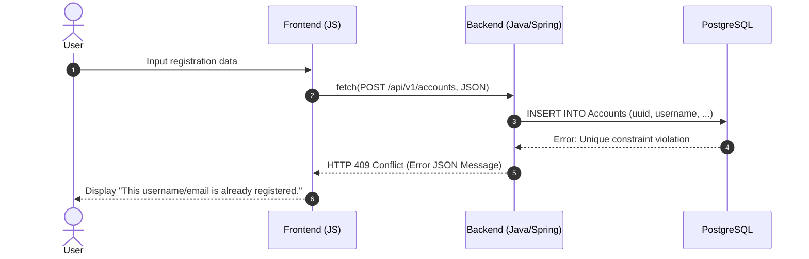
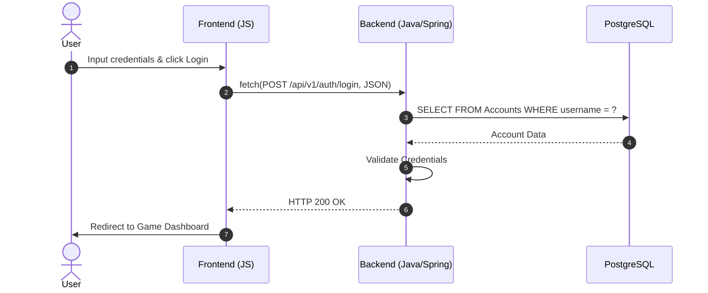

<h3 align="center">USE REGISTRATION (HAPPY PATH)</h3>
This flow describes the successful creation of a new account and its persistence in PostgreSQL.


<h3 align="center">ERROR BY LATENCY</h3>

<h3 align="center">DATA CONFLICT</h3>

<h3 align="center">USER AUTHENTICATE</h3>

<h3 align="center">INVALID CREDENTIALS</h3>
```mermaid
sequenceDiagram
    autonumber
    actor User
    participant Front as Frontend (JS)
    participant Back as Backend (Java/Spring)
    participant DB as PostgreSQL

    User->>Front: Input wrong credentials
    Front->>Back: fetch(POST /api/v1/auth/login, JSON)
    Back->>DB: SELECT FROM Accounts...
    DB-->>Back: Account not found OR password mismatch
    Back-->>Front: HTTP 401 Unauthorized (Error Message)
    Front-->>User: Display "Invalid username or password."